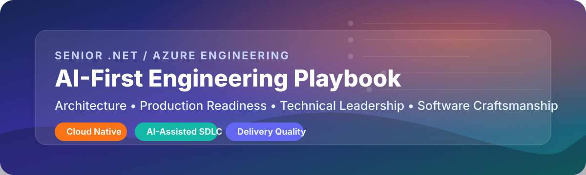

# Harshil Shah — Engineering Playbook

> Practical engineering principles, delivery patterns, and architecture guidance shaped by 14 years of building software across regulated platforms, enterprise systems, and modern cloud applications.

## Welcome

Hello, I'm **Harshil Shah**, a **Senior Full Stack Engineer** focused on building reliable, maintainable, and scalable software. My core experience spans **.NET Core, C#, Python, React, Azure, and AWS**, with a delivery background that combines engineering excellence, product thinking, and operational pragmatism.

This playbook is my personal reference for the standards I expect from production systems: clean design, thoughtful architecture, strong code review culture, and sustainable engineering habits.
You can also follow my work on **GitHub** at [github.com/harshil-sh](https://github.com/harshil-sh).

## Why this playbook exists

I created this site for three reasons:

1. **Capture durable engineering principles** that stay useful across teams, domains, and technology stacks.
2. **Document repeatable patterns** for system design, code quality, and technical decision-making.
3. **Share a working reference** that reflects how I approach software as a senior engineer targeting **Senior, Lead, and Staff engineering roles** in the **UK, Netherlands, Germany, and Ireland**.

## Contents

The playbook navigation is organised around how senior engineers move from principles to delivery: foundations, architecture, AI-enabled execution, technical leadership, and portfolio evidence.

| Navigation area | Start here | One-line description |
| --- | --- | --- |
| Foundations | [Engineering Principles](engineering-principles.md) | Core engineering standards for maintainable systems, software craftsmanship, testing, and pragmatic implementation. |
| Architecture & Design | [Architecture Decision Framework](architecture-decision-framework.md) | Decision-making tools for system design, ADRs, production readiness, and scalable architecture trade-offs. |
| AI-First Engineering | [AI-Assisted Engineering](ai-assisted-engineering.md) | Practical guidance for using AI tools safely across development, review, documentation, and productivity workflows. |
| Technical Leadership | [Code Review Guide](code-review-guide.md) | Leadership practices for reviews, metrics, incidents, mentoring, and senior engineering communication. |
| Portfolio Evidence | [Case Studies](case-studies.md) | Career context and delivery examples aligned to Senior .NET/Azure, technical leadership, and production engineering roles. |
| Playbook | [Tech Stack Rubric](playbook/decision-frameworks/tech-stack-rubric.md) | Reusable templates, rubrics, and operating practices for teams building production software. |

## How to use this playbook

You can use this site in whichever way best matches your workflow:

- **As a reference** when designing a service, reviewing code, or defining engineering standards.
- **As a coaching tool** for helping teams align on maintainability, design quality, and delivery discipline.
- **As an interview preparation resource** for conversations around architecture, trade-offs, engineering leadership, and software craftsmanship.
- **As a personal benchmark** for the technical bar I aim to uphold in every project.

### Suggested reading paths

- Start with [Engineering Principles](engineering-principles.md) if you want the mindset behind the rest of the playbook.
- Continue to [SOLID Principles](solid-principles.md) and [Code Review Guidelines](code-review-guidelines.md) for day-to-day engineering practice.
- Use [System Design Patterns](system-design-patterns.md) and [Architecture Decision Records](architecture-decision-records.md) when making larger technical decisions.
- Refer to [Python Best Practices](python-best-practices.md) when working in Python-heavy services, tooling, or automation.
- Visit [About](about.md) for the career context behind the perspectives captured here.

### Search guide

Use site search with role, technology, and practice keywords rather than only page titles. The content is intentionally cross-linked around senior engineering themes such as **.NET**, **Azure**, **architecture**, **AI-assisted engineering**, **production readiness**, **code review**, **incident response**, and **mentoring**.

| Search intent | Useful starting points |
| --- | --- |
| Architecture decisions and trade-offs | [Architecture Decision Framework](architecture-decision-framework.md), [Architecture Decision Records](architecture-decision-records.md), [Tech Stack Rubric](playbook/decision-frameworks/tech-stack-rubric.md) |
| Production-ready Azure services | [Production Readiness Checklist](production-readiness-checklist.md), [System Design](system-design.md), [Incident Response](incident-response.md) |
| AI-assisted engineering workflows | [AI-Assisted Engineering](ai-assisted-engineering.md), [Agentic Development](agentic-development.md), [AI Governance](playbook/ai-workflow/governance.md) |
| Engineering leadership and quality | [Code Review Guide](code-review-guide.md), [Engineering Metrics](engineering-metrics.md), [Mentoring](mentoring.md) |

## Living document notice

!!! info "Living document"
    This playbook is continuously updated as I learn from new systems, delivery challenges, architecture reviews, and production incidents. The guidance here is intended to stay practical and current rather than static.

## Technology stack

| Domain | Primary technologies | How I use them |
| --- | --- | --- |
| Backend Engineering | .NET Core, C#, Python | APIs, distributed services, background jobs, automation, integration layers |
| Frontend Engineering | React, JavaScript, TypeScript | Internal platforms, responsive web applications, and product-facing interfaces |
| Cloud & DevOps | Azure, AWS, GitHub Actions | CI/CD, infrastructure workflows, deployment automation, and cloud-native delivery |
| Architecture | REST APIs, event-driven design, ADRs, observability patterns | Designing systems that scale safely and evolve predictably |
| Engineering Excellence | Testing strategy, code review, refactoring, documentation | Improving delivery quality and long-term maintainability |

## Career highlights

- **14 years of engineering experience** across full stack product and platform development.
- **Senior Software Engineer at Ofgem UK**, contributing to software delivery in a regulated environment.
- **Asian Banker Award — Best Retail Banking Software** for work on the **HRMS platform for Axis Bank**.
- Deep hands-on expertise across **enterprise backend systems**, **modern frontend applications**, and **cloud delivery practices**.
- Strong alignment with high-impact engineering roles spanning **Senior**, **Lead**, and **Staff Engineer** expectations.

## A personal note on continuous learning

The most valuable engineers I have worked with combine curiosity with consistency. They keep learning, but they also keep shipping. This playbook reflects that mindset. It is not a fixed statement of perfection; it is a living body of lessons from real systems, real trade-offs, and a long-term commitment to getting better at the craft of engineering.

If you are building software that needs to be reliable, understandable, and adaptable, I hope this playbook gives you something useful to take into your next design review, sprint, or production release.
