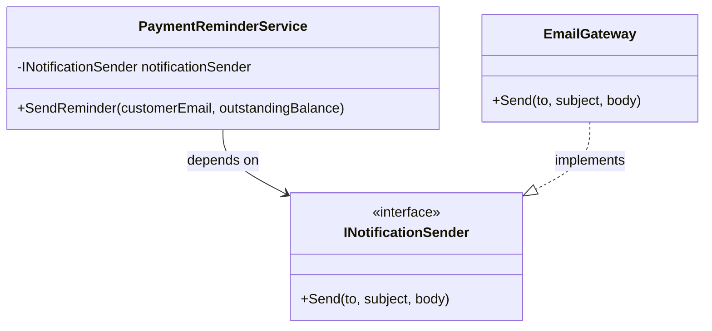

# SOLID Principles

## 1. Introduction

SOLID is a set of design principles that helps engineers build software that is easier to change, test, understand, and extend. In enterprise systems—especially ones handling regulated data, money, customer journeys, operational workflows, or audit-sensitive decisions—these principles reduce the risk of fragile code and expensive regressions.

For teams working on financial systems, energy regulation platforms, and enterprise HR products, SOLID is not just an academic exercise. It directly supports:

- safer changes in large codebases with multiple contributors;
- easier testing of critical workflows such as billing, payments, case handling, and employee lifecycle events;
- clearer separation between business rules, infrastructure, and presentation concerns;
- lower risk when regulations, APIs, or reporting requirements change.

As a Senior Full Stack Engineer working across .NET, Python, React, and Azure, you will often see SOLID play out in APIs, background services, domain services, integrations, and orchestration layers rather than in UI components alone. In .NET, SOLID often appears through interfaces, dependency injection, small services, and explicit contracts. In Python, the same ideas usually show up through abstract base classes, protocols, composition, and careful module boundaries.

The syntax differs, but the engineering intent is the same:

- **.NET / C#** tends to make contracts explicit with interfaces, typed dependencies, and built-in dependency injection.
- **Python** tends to be more flexible, but still benefits from disciplined abstractions, dependency injection, and separation of concerns.

---

## 2. Single Responsibility Principle

> **A class, module, or function should have one reason to change.**

### Plain English explanation

A component should do one job well. If a class handles business rules, database access, email delivery, logging, and report formatting all at once, every unrelated change becomes risky.

In enterprise systems, SRP is especially important because business rules change frequently, while infrastructure concerns such as storage or notifications often change for different reasons. Mixing them increases coupling and makes testing harder.

### Real world analogy

Think of an energy regulator case team:

- one person reviews compliance evidence;
- another sends formal correspondence;
- another updates the case management system.

If one person tried to do all three in a single uncontrolled workflow, mistakes and delays would increase. Clear responsibilities improve quality and accountability.

### C# violation example with comments explaining what is wrong

```csharp
using System;
using System.Collections.Generic;
using System.Net.Mail;

namespace EngineeringPlaybook.Solid.SrpViolation;

public class TariffChangeProcessor
{
    public void ProcessChange(string supplierId, decimal previousRate, decimal newRate, string customerEmail)
    {
        // Business rule calculation lives here.
        decimal percentageIncrease = ((newRate - previousRate) / previousRate) * 100;

        if (percentageIncrease > 10)
        {
            Console.WriteLine("Flagging material tariff increase for review.");
        }

        // Persistence concern also lives here.
        SaveAuditRecord(supplierId, previousRate, newRate, percentageIncrease);

        // Notification concern also lives here.
        SendCustomerEmail(customerEmail, newRate);
    }

    private void SaveAuditRecord(string supplierId, decimal previousRate, decimal newRate, decimal percentageIncrease)
    {
        // This would normally write to a database, but the class is now responsible
        // for persistence as well as tariff analysis.
        Console.WriteLine($"Saved audit for {supplierId}: {previousRate} -> {newRate} ({percentageIncrease:N2}%).");
    }

    private void SendCustomerEmail(string customerEmail, decimal newRate)
    {
        using MailMessage message = new("noreply@regulator.example", customerEmail)
        {
            Subject = "Tariff update",
            Body = $"Your tariff has changed to {newRate:C}."
        };

        // The class now owns SMTP/email behaviour too.
        Console.WriteLine($"Email queued to {message.To[0].Address}.");
    }
}
```

**What is wrong here?**

- tariff change analysis is mixed with audit persistence;
- customer notification is mixed with domain decision-making;
- changing email delivery should not require modifying tariff evaluation logic;
- unit testing becomes awkward because side effects happen inside the same class.

### C# correct implementation

```csharp
using System;

namespace EngineeringPlaybook.Solid.SrpCorrect;

public sealed record TariffChange(string SupplierId, decimal PreviousRate, decimal NewRate, string CustomerEmail);

public sealed record TariffAssessment(decimal PercentageIncrease, bool RequiresReview);

public interface ITariffAssessmentService
{
    TariffAssessment Assess(TariffChange change);
}

public interface IAuditRepository
{
    void Save(string supplierId, decimal previousRate, decimal newRate, decimal percentageIncrease);
}

public interface ICustomerNotificationService
{
    void SendTariffUpdate(string customerEmail, decimal newRate);
}

public sealed class TariffAssessmentService : ITariffAssessmentService
{
    public TariffAssessment Assess(TariffChange change)
    {
        decimal percentageIncrease = ((change.NewRate - change.PreviousRate) / change.PreviousRate) * 100;
        bool requiresReview = percentageIncrease > 10;

        return new TariffAssessment(percentageIncrease, requiresReview);
    }
}

public sealed class TariffChangeWorkflow
{
    private readonly ITariffAssessmentService _assessmentService;
    private readonly IAuditRepository _auditRepository;
    private readonly ICustomerNotificationService _notificationService;

    public TariffChangeWorkflow(
        ITariffAssessmentService assessmentService,
        IAuditRepository auditRepository,
        ICustomerNotificationService notificationService)
    {
        _assessmentService = assessmentService;
        _auditRepository = auditRepository;
        _notificationService = notificationService;
    }

    public void Process(TariffChange change)
    {
        TariffAssessment assessment = _assessmentService.Assess(change);

        _auditRepository.Save(
            change.SupplierId,
            change.PreviousRate,
            change.NewRate,
            assessment.PercentageIncrease);

        _notificationService.SendTariffUpdate(change.CustomerEmail, change.NewRate);

        if (assessment.RequiresReview)
        {
            Console.WriteLine("Material increase flagged for compliance review.");
        }
    }
}
```

### Python equivalent example

```python
from dataclasses import dataclass
from typing import Protocol


@dataclass(frozen=True)
class PayrollAdjustment:
    employee_id: str
    old_salary: float
    new_salary: float
    manager_email: str


@dataclass(frozen=True)
class AdjustmentAssessment:
    percentage_change: float
    requires_hr_review: bool


class AssessmentService(Protocol):
    def assess(self, adjustment: PayrollAdjustment) -> AdjustmentAssessment:
        ...


class AuditRepository(Protocol):
    def save(self, adjustment: PayrollAdjustment, percentage_change: float) -> None:
        ...


class NotificationService(Protocol):
    def notify_manager(self, manager_email: str, employee_id: str, new_salary: float) -> None:
        ...


class SalaryAssessmentService:
    def assess(self, adjustment: PayrollAdjustment) -> AdjustmentAssessment:
        percentage_change = ((adjustment.new_salary - adjustment.old_salary) / adjustment.old_salary) * 100
        requires_hr_review = percentage_change >= 15
        return AdjustmentAssessment(percentage_change=percentage_change, requires_hr_review=requires_hr_review)


class PayrollAdjustmentWorkflow:
    def __init__(
        self,
        assessment_service: AssessmentService,
        audit_repository: AuditRepository,
        notification_service: NotificationService,
    ) -> None:
        self._assessment_service = assessment_service
        self._audit_repository = audit_repository
        self._notification_service = notification_service

    def process(self, adjustment: PayrollAdjustment) -> None:
        assessment = self._assessment_service.assess(adjustment)
        self._audit_repository.save(adjustment, assessment.percentage_change)
        self._notification_service.notify_manager(
            adjustment.manager_email,
            adjustment.employee_id,
            adjustment.new_salary,
        )

        if assessment.requires_hr_review:
            print("Escalate pay adjustment for HR governance review.")
```

### Practical checklist

- Does this class have more than one reason to change?
- Are business rules separated from I/O, persistence, email, or API calls?
- Can the core logic be unit tested without a database or external service?
- Are orchestration concerns separated from calculation concerns?
- If a regulation changes, can you update the rule without rewriting infrastructure code?

---

## 3. Open Closed Principle

> **Software entities should be open for extension but closed for modification.**

### Plain English explanation

You should be able to add new behaviour without repeatedly editing stable, already-tested code. Instead of adding more `if` or `switch` branches every time the business introduces a new rule, create an abstraction and plug in a new implementation.

This matters in enterprise systems because new payment methods, supplier categories, tariff schemes, or employee benefit types arrive regularly. Constantly editing a central conditional block leads to regression-prone code.

### Real world analogy

Think of a building with badge-controlled doors. When a new employee joins, security should issue a new badge rather than rebuild the whole door system. The system is extended by adding a new credential, not by changing the door logic itself.

### C# violation example

```csharp
using System;

namespace EngineeringPlaybook.Solid.OcpViolation;

public sealed class InvoiceFeeCalculator
{
    public decimal CalculateFee(string paymentType, decimal amount)
    {
        if (paymentType == "Card")
        {
            return amount * 0.015m;
        }

        if (paymentType == "BankTransfer")
        {
            return 2.50m;
        }

        if (paymentType == "DirectDebit")
        {
            return amount * 0.005m;
        }

        throw new NotSupportedException($"Payment type '{paymentType}' is not supported.");
    }
}
```

Every new payment type requires modifying this class, retesting it, and risking accidental breakage of existing fee rules.

### C# correct implementation using interfaces

```csharp
using System;
using System.Collections.Generic;
using System.Linq;

namespace EngineeringPlaybook.Solid.OcpCorrect;

public interface IFeeStrategy
{
    string PaymentType { get; }
    decimal Calculate(decimal amount);
}

public sealed class CardFeeStrategy : IFeeStrategy
{
    public string PaymentType => "Card";

    public decimal Calculate(decimal amount) => amount * 0.015m;
}

public sealed class BankTransferFeeStrategy : IFeeStrategy
{
    public string PaymentType => "BankTransfer";

    public decimal Calculate(decimal amount) => 2.50m;
}

public sealed class DirectDebitFeeStrategy : IFeeStrategy
{
    public string PaymentType => "DirectDebit";

    public decimal Calculate(decimal amount) => amount * 0.005m;
}

public sealed class InvoiceFeeCalculator
{
    private readonly IReadOnlyDictionary<string, IFeeStrategy> _strategies;

    public InvoiceFeeCalculator(IEnumerable<IFeeStrategy> strategies)
    {
        _strategies = strategies.ToDictionary(strategy => strategy.PaymentType, StringComparer.OrdinalIgnoreCase);
    }

    public decimal CalculateFee(string paymentType, decimal amount)
    {
        if (!_strategies.TryGetValue(paymentType, out IFeeStrategy? strategy))
        {
            throw new NotSupportedException($"Payment type '{paymentType}' is not supported.");
        }

        return strategy.Calculate(amount);
    }
}
```

To support a new payment type such as `OpenBanking`, add a new strategy class and register it. The calculator itself does not change.

### Python equivalent using abstract base classes

```python
from abc import ABC, abstractmethod
from dataclasses import dataclass


class ComplianceRule(ABC):
    @property
    @abstractmethod
    def market_segment(self) -> str:
        raise NotImplementedError

    @abstractmethod
    def evaluate(self, annual_revenue: float) -> str:
        raise NotImplementedError


@dataclass(frozen=True)
class DomesticSupplyRule(ComplianceRule):
    @property
    def market_segment(self) -> str:
        return "domestic"

    def evaluate(self, annual_revenue: float) -> str:
        return "enhanced-review" if annual_revenue >= 50_000_000 else "standard-review"


@dataclass(frozen=True)
class IndustrialSupplyRule(ComplianceRule):
    @property
    def market_segment(self) -> str:
        return "industrial"

    def evaluate(self, annual_revenue: float) -> str:
        return "board-review" if annual_revenue >= 100_000_000 else "standard-review"


class ComplianceRuleEngine:
    def __init__(self, rules: list[ComplianceRule]) -> None:
        self._rules = {rule.market_segment: rule for rule in rules}

    def evaluate(self, market_segment: str, annual_revenue: float) -> str:
        try:
            rule = self._rules[market_segment]
        except KeyError as exc:
            raise ValueError(f"Unsupported market segment: {market_segment}") from exc

        return rule.evaluate(annual_revenue)
```

### Practical checklist

- Do I keep editing the same class every time a new variation appears?
- Can I add new behaviour by introducing a new implementation instead of changing old code?
- Are condition-heavy dispatch blocks hiding a missing abstraction?
- Is extension done through composition, registration, or configuration?
- Can I ship a new business rule with minimal regression risk to existing flows?

---

## 4. Liskov Substitution Principle

> **Subtypes must be usable wherever their base type is expected, without breaking correctness.**

### Plain English explanation

If code works with a base type, it should also work with any subtype. A subtype must honour the promises of the parent contract. If a subclass throws exceptions for valid operations, changes expected behaviour, or weakens guarantees, it breaks LSP.

This often appears when inheritance is used for convenience rather than correctness.

### Real world analogy

If a building sign says "accessible entrance," every entrance marked that way should genuinely support accessible access. If one of those doors only works for some visitors, the sign is misleading. The same is true for software contracts.

### C# violation example

```csharp
using System;

namespace EngineeringPlaybook.Solid.LspViolation;

public class DocumentStorage
{
    public virtual void Save(string documentName, byte[] content)
    {
        Console.WriteLine($"Saved {documentName}.");
    }
}

public sealed class ReadOnlyArchiveStorage : DocumentStorage
{
    public override void Save(string documentName, byte[] content)
    {
        throw new InvalidOperationException("Archive storage is read-only.");
    }
}

public sealed class ComplianceEvidenceService
{
    private readonly DocumentStorage _storage;

    public ComplianceEvidenceService(DocumentStorage storage)
    {
        _storage = storage;
    }

    public void StoreEvidence(string documentName, byte[] content)
    {
        // The service assumes any DocumentStorage can save content.
        // ReadOnlyArchiveStorage breaks that assumption.
        _storage.Save(documentName, content);
    }
}
```

The subtype is not a valid substitute because it violates the expected behaviour of `Save`.

### C# correct implementation

```csharp
using System;

namespace EngineeringPlaybook.Solid.LspCorrect;

public interface IReadableDocumentStore
{
    byte[] Get(string documentName);
}

public interface IWritableDocumentStore : IReadableDocumentStore
{
    void Save(string documentName, byte[] content);
}

public sealed class ActiveCaseDocumentStore : IWritableDocumentStore
{
    public byte[] Get(string documentName)
    {
        Console.WriteLine($"Retrieving {documentName} from active storage.");
        return Array.Empty<byte>();
    }

    public void Save(string documentName, byte[] content)
    {
        Console.WriteLine($"Saved {documentName} to active storage.");
    }
}

public sealed class ArchiveDocumentStore : IReadableDocumentStore
{
    public byte[] Get(string documentName)
    {
        Console.WriteLine($"Retrieving {documentName} from archive storage.");
        return Array.Empty<byte>();
    }
}

public sealed class ComplianceEvidenceService
{
    private readonly IWritableDocumentStore _storage;

    public ComplianceEvidenceService(IWritableDocumentStore storage)
    {
        _storage = storage;
    }

    public void StoreEvidence(string documentName, byte[] content)
    {
        _storage.Save(documentName, content);
    }
}
```

The design is fixed by modelling the true capabilities explicitly, rather than pretending all stores support writes.

### Python equivalent

```python
from abc import ABC, abstractmethod


class ReportExporter(ABC):
    @abstractmethod
    def export(self, report_name: str, content: bytes) -> None:
        raise NotImplementedError


class SecureBlobExporter(ReportExporter):
    def export(self, report_name: str, content: bytes) -> None:
        print(f"Exported {report_name} to Azure Blob Storage.")


class PayrollReportService:
    def __init__(self, exporter: ReportExporter) -> None:
        self._exporter = exporter

    def publish(self, report_name: str, content: bytes) -> None:
        self._exporter.export(report_name, content)
```

A bad substitute would be a class that inherits `ReportExporter` but raises an exception in `export` for normal reports. A better design is to create separate abstractions for exporters and readers if capabilities differ.

### Practical checklist

- Can every subtype truly honour the parent contract?
- Does any subclass throw `NotSupportedException`, `InvalidOperationException`, or similar for normal operations?
- Are preconditions becoming stricter in subtypes?
- Are postconditions weaker in subtypes?
- Is inheritance being used where composition or narrower interfaces would be safer?

---

## 5. Interface Segregation Principle

> **Clients should not be forced to depend on methods they do not use.**

### Plain English explanation

Large, broad interfaces create accidental coupling. Consumers end up depending on operations irrelevant to their use case. This makes implementations awkward, increases mocking overhead, and often leads to empty methods or runtime exceptions.

ISP encourages small, focused interfaces aligned to specific responsibilities.

### Real world analogy

A company building pass should grant access only to the areas a person needs. Forcing every employee to carry permissions for finance, HR, server rooms, and executive areas is both inefficient and risky.

### C# violation example — fat interface

```csharp
using System;
using System.Collections.Generic;

namespace EngineeringPlaybook.Solid.IspViolation;

public interface IHrPlatformService
{
    void CreateEmployeeProfile(string employeeId, string fullName);
    void ProcessPayroll(string employeeId, decimal grossPay);
    void EnrolInBenefits(string employeeId, string planCode);
    IReadOnlyList<string> GenerateBoardLevelWorkforceReport();
}

public sealed class BenefitsPortalClient : IHrPlatformService
{
    public void CreateEmployeeProfile(string employeeId, string fullName)
    {
        throw new NotSupportedException();
    }

    public void ProcessPayroll(string employeeId, decimal grossPay)
    {
        throw new NotSupportedException();
    }

    public void EnrolInBenefits(string employeeId, string planCode)
    {
        Console.WriteLine($"Enrolled {employeeId} into {planCode}.");
    }

    public IReadOnlyList<string> GenerateBoardLevelWorkforceReport()
    {
        throw new NotSupportedException();
    }
}
```

This implementation only cares about benefits enrolment but is forced to implement unrelated payroll, profile, and reporting methods.

### C# correct implementation — focused interfaces

```csharp
using System;
using System.Collections.Generic;

namespace EngineeringPlaybook.Solid.IspCorrect;

public interface IEmployeeProfileService
{
    void CreateEmployeeProfile(string employeeId, string fullName);
}

public interface IPayrollService
{
    void ProcessPayroll(string employeeId, decimal grossPay);
}

public interface IBenefitsEnrolmentService
{
    void EnrolInBenefits(string employeeId, string planCode);
}

public interface IWorkforceReportingService
{
    IReadOnlyList<string> GenerateBoardLevelWorkforceReport();
}

public sealed class BenefitsPortalClient : IBenefitsEnrolmentService
{
    public void EnrolInBenefits(string employeeId, string planCode)
    {
        Console.WriteLine($"Enrolled {employeeId} into {planCode}.");
    }
}

public sealed class PayrollProcessor : IPayrollService
{
    public void ProcessPayroll(string employeeId, decimal grossPay)
    {
        Console.WriteLine($"Processed payroll for {employeeId}: {grossPay:C}.");
    }
}
```

### Python equivalent

```python
from typing import Protocol


class CaseCreator(Protocol):
    def create_case(self, supplier_id: str, case_type: str) -> str:
        ...


class EvidenceUploader(Protocol):
    def upload_evidence(self, case_id: str, file_name: str, content: bytes) -> None:
        ...


class EnforcementNotifier(Protocol):
    def notify(self, case_id: str, message: str) -> None:
        ...


class AzureBlobEvidenceUploader:
    def upload_evidence(self, case_id: str, file_name: str, content: bytes) -> None:
        print(f"Uploaded {file_name} for case {case_id} to blob storage.")
```

Each client depends only on the protocol it actually needs.

### Practical checklist

- Does any interface contain methods that some implementations cannot sensibly support?
- Do tests require excessive mocking because interfaces are too broad?
- Are there repeated `NotSupportedException` implementations?
- Can the interface be split by use case or consumer type?
- Does each consumer depend only on the behaviour it actually uses?

---

## 6. Dependency Inversion Principle

> **High-level modules should not depend on low-level modules. Both should depend on abstractions.**

### Plain English explanation

Core business workflows should not be tightly coupled to concrete infrastructure classes. Instead of a business service directly creating a specific email sender, repository, or API client with `new`, it should depend on an abstraction and receive the implementation from outside.

This keeps business logic testable and allows infrastructure choices to change without rewriting domain code.

### Real world analogy

A laptop plugs into a standard power adapter interface. The laptop does not care whether electricity comes from a wall socket in London, a docking station, or a travel adapter. The abstraction stays stable while the implementation can vary.

### C# violation — `new` keyword inside class

```csharp
using System;

namespace EngineeringPlaybook.Solid.DipViolation;

public sealed class PaymentReminderService
{
    public void SendReminder(string customerEmail, decimal outstandingBalance)
    {
        EmailGateway gateway = new();

        string body = $"Your outstanding balance is {outstandingBalance:C}. Please pay within 14 days.";
        gateway.Send(customerEmail, "Payment reminder", body);
    }
}

public sealed class EmailGateway
{
    public void Send(string to, string subject, string body)
    {
        Console.WriteLine($"Sent '{subject}' to {to}. Message: {body}");
    }
}
```

This high-level service is directly coupled to a concrete gateway. It is harder to test and harder to swap to another provider such as SendGrid, Microsoft Graph, or a regulated internal notification service.

### C# correct — constructor injection with .NET Core DI container registration example

```csharp
using System;
using Microsoft.Extensions.DependencyInjection;

namespace EngineeringPlaybook.Solid.DipCorrect;

public interface INotificationSender
{
    void Send(string to, string subject, string body);
}

public sealed class EmailGateway : INotificationSender
{
    public void Send(string to, string subject, string body)
    {
        Console.WriteLine($"Sent '{subject}' to {to}. Message: {body}");
    }
}

public sealed class PaymentReminderService
{
    private readonly INotificationSender _notificationSender;

    public PaymentReminderService(INotificationSender notificationSender)
    {
        _notificationSender = notificationSender;
    }

    public void SendReminder(string customerEmail, decimal outstandingBalance)
    {
        string body = $"Your outstanding balance is {outstandingBalance:C}. Please pay within 14 days.";
        _notificationSender.Send(customerEmail, "Payment reminder", body);
    }
}

public static class DependencyRegistration
{
    public static ServiceProvider BuildProvider()
    {
        ServiceCollection services = new();
        services.AddScoped<INotificationSender, EmailGateway>();
        services.AddScoped<PaymentReminderService>();

        return services.BuildServiceProvider();
    }
}
```

### Python equivalent with dependency injection

```python
from dataclasses import dataclass
from typing import Protocol


class NotificationSender(Protocol):
    def send(self, to: str, subject: str, body: str) -> None:
        ...


@dataclass
class TeamsNotificationSender:
    webhook_url: str

    def send(self, to: str, subject: str, body: str) -> None:
        print(f"Posting '{subject}' notification for {to} via Teams webhook {self.webhook_url}.")


class EnforcementAlertService:
    def __init__(self, notification_sender: NotificationSender) -> None:
        self._notification_sender = notification_sender

    def send_breach_alert(self, case_officer: str, supplier_name: str) -> None:
        subject = f"Urgent compliance alert: {supplier_name}"
        body = f"A new potential licence breach requires review by {case_officer}."
        self._notification_sender.send(case_officer, subject, body)
```

### Mermaid class diagram showing dependency flow



### Practical checklist

- Does business logic create infrastructure dependencies directly with `new`?
- Can I test the workflow by substituting a fake or mock dependency?
- Are abstractions owned close to the business need rather than hidden inside infrastructure?
- Is the composition root responsible for wiring dependencies together?
- Would changing provider, storage, or transport require minimal edits to high-level logic?

---

## 7. SOLID Quick Reference Table

| Principle | One Line Summary | Violation Signal | Fix |
| --- | --- | --- | --- |
| **S — Single Responsibility** | One component should have one reason to change. | A service mixes business rules, persistence, notifications, and formatting. | Split orchestration, domain logic, and infrastructure into focused components. |
| **O — Open Closed** | Extend behaviour without editing stable code paths. | Large `if`/`switch` blocks grow whenever a new rule or type appears. | Introduce interfaces/ABCs and add new implementations. |
| **L — Liskov Substitution** | Subtypes must honour the parent contract. | A subclass throws for valid operations or changes expected behaviour. | Model capabilities correctly and avoid invalid inheritance. |
| **I — Interface Segregation** | Consumers should depend only on what they use. | Interfaces are broad, forcing unused methods and `NotSupportedException`. | Split fat contracts into focused interfaces or protocols. |
| **D — Dependency Inversion** | Depend on abstractions, not concrete infrastructure details. | High-level services instantiate gateways, repositories, or clients directly. | Inject abstractions and wire implementations in the composition root. |

---

## Final thoughts

SOLID does not mean adding abstractions everywhere. It means introducing the **right** boundaries where change is likely, risk is high, or testing matters. In regulated enterprise environments—such as payments, energy compliance, customer operations, and HR platforms—these principles help teams move faster without sacrificing maintainability or audit confidence.

Use SOLID pragmatically:

- apply SRP when classes start accumulating unrelated responsibilities;
- apply OCP when variation is expected;
- apply LSP when inheritance is considered;
- apply ISP when interfaces become broad and awkward;
- apply DIP when business logic starts depending directly on technology choices.

When used well, SOLID makes systems easier to evolve as policies change, integrations expand, and delivery teams grow.
