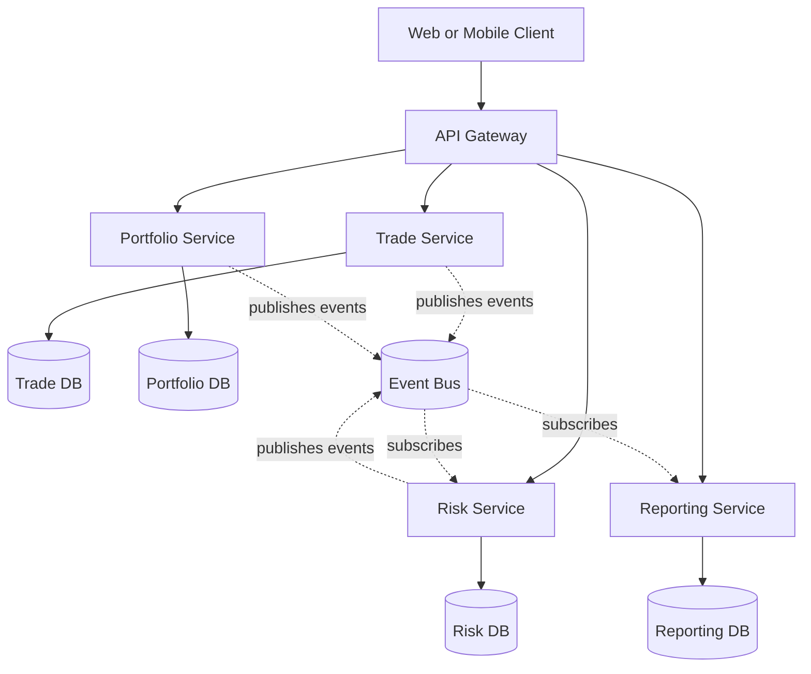
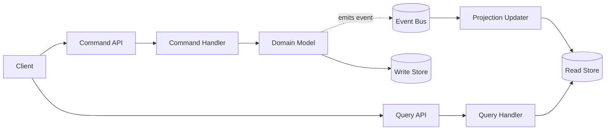
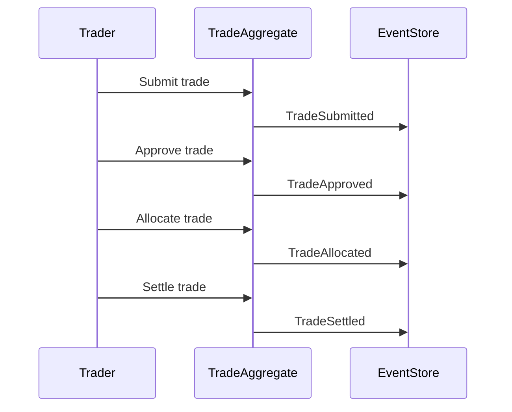
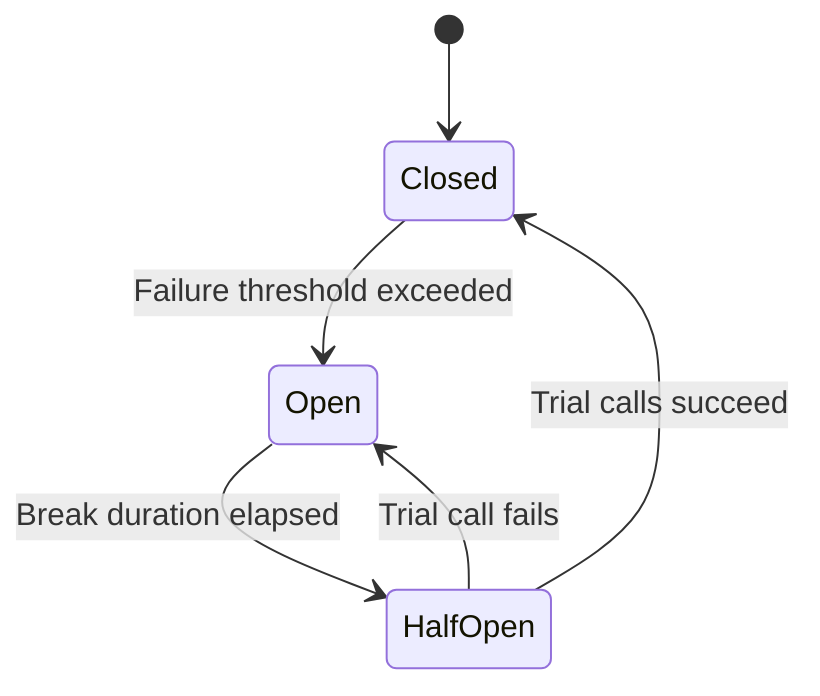
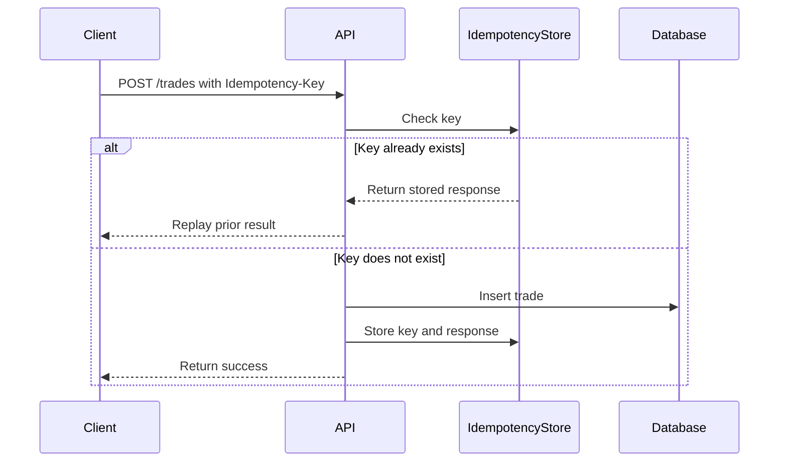

# System Design Patterns

System design patterns become most valuable when architecture decisions start to constrain delivery speed, reliability, compliance, or cost. Early-stage systems can often succeed with simple structures and a small number of well-understood components. As the system grows, however, decisions about boundaries, data ownership, consistency, failure handling, and auditability become harder to reverse. That is the point where design discipline matters most.

Patterns are best treated as reusable solutions to recurring problems, not as defaults to apply blindly. A pattern gives you a vocabulary and a reference model. A principle helps you decide whether the pattern fits. For example, **separation of concerns**, **minimizing operational complexity**, **observability**, **explicit ownership**, and **failure isolation** are principles. CQRS, event sourcing, monoliths, microservices, circuit breakers, and idempotency are patterns or architectural styles. Strong system design comes from applying principles first, then choosing the smallest pattern that solves the real problem.

## 1. Introduction

### When system design decisions matter most

System design decisions matter most when one or more of the following conditions are true:

- **The cost of failure is high**: outages cause financial loss, regulatory exposure, or reputational damage.
- **The domain is complex**: multiple workflows, business rules, or bounded contexts compete for clarity.
- **Scale is becoming uneven**: one part of the system needs to scale independently from the rest.
- **Teams are growing**: architecture has to support parallel delivery without constant coordination overhead.
- **Auditability matters**: the organization must explain who changed what, when, and why.
- **Latency and reliability expectations tighten**: customers or internal stakeholders depend on predictable performance.
- **Integration count increases**: more upstream and downstream systems means more coupling and more failure modes.

A practical question to ask is: **what will be expensive to change in six to twelve months?** If the answer includes service boundaries, data models, consistency guarantees, or integration contracts, design decisions deserve deliberate attention now.

### How to think about patterns vs principles

A useful way to evaluate any design pattern is through these principles:

- **Simplicity first**: prefer the least operationally expensive design that can satisfy current needs.
- **Explicit trade-offs**: every pattern introduces costs in development, debugging, and operations.
- **Failure-aware design**: distributed systems fail in partial, delayed, and asymmetric ways.
- **Data ownership clarity**: each component should have a clear source of truth.
- **Evolvability**: choose structures that support likely future changes without requiring a rewrite.
- **Compliance and observability by design**: in regulated systems, traceability is a feature, not an afterthought.

Patterns should answer a specific architectural problem. If the problem is still vague, a principle-driven simplification usually beats a pattern-heavy design.

## 2. Microservices vs Monolith

A monolith packages the application as a single deployable unit, often with a shared data store and in-process module boundaries. A microservices architecture decomposes the system into independently deployable services with explicit APIs and separate operational lifecycles.

### Decision framework — when to choose each

Choose a **monolith** when:

- The product is still finding market fit.
- One team owns most of the codebase.
- Domain boundaries are not stable yet.
- End-to-end workflows require strong transactional consistency.
- Operational capacity is limited.
- Simpler deployments and debugging are more important than independent scaling.

Choose **microservices** when:

- Multiple teams need to deliver independently.
- Parts of the system have very different scaling characteristics.
- Bounded contexts are clear and stable.
- Failure isolation between domains is important.
- Different services need different data stores or runtimes.
- The organization can support service ownership, observability, platform tooling, and incident response.

A practical rule is to start with a modular monolith unless there is a strong, immediate reason to distribute. Distribution solves some organizational and scaling problems while creating network, operational, and data consistency problems.

### Pros and cons

| Architecture | Pros | Cons |
| --- | --- | --- |
| Monolith | Simple deployment pipeline, easier local development, straightforward debugging, easier transactional consistency, lower operational overhead | Scaling is coarse-grained, releases are coupled, large codebases become harder to reason about, team autonomy can decline as the codebase grows |
| Microservices | Independent deployments, better team autonomy, selective scaling, stronger domain boundaries, fault isolation, technology flexibility | Higher operational complexity, distributed tracing required, eventual consistency challenges, harder local testing, network failures become normal, governance overhead increases |

### Example microservices topology



### Migration path from monolith to microservices

A safe migration path usually looks like this:

1. **Strengthen modular boundaries inside the monolith**.
   - Separate domain modules.
   - Reduce shared database coupling.
   - Introduce clear internal interfaces.
2. **Identify seams with asymmetric scaling or change frequency**.
   - Reporting, notifications, search, and risk calculation are common extraction candidates.
3. **Extract one service at a time**.
   - Prefer a capability with clear ownership and limited transactional coupling.
4. **Use API or event-based integration**.
   - Avoid direct database sharing between the monolith and new services.
5. **Establish observability before scaling the approach**.
   - Logging, tracing, metrics, and dashboards should mature alongside service extraction.
6. **Move ownership to aligned teams**.
   - Service ownership should include on-call, deployment, and run-time accountability.
7. **Retire monolith dependencies deliberately**.
   - Do not leave “temporary” shared tables or hidden backdoor integrations in place indefinitely.

The most common failure mode is premature decomposition without strong domain boundaries. A well-structured monolith is often the fastest path to learning what should eventually become a service.

## 3. CQRS Pattern

CQRS stands for **Command Query Responsibility Segregation**. It separates operations that **change state** from operations that **read state**. Commands represent intent to modify the system. Queries return data without changing system state.

### Command vs Query separation explained clearly

In a traditional CRUD model, the same object model often handles creates, updates, reads, validation, persistence, and response formatting. That works well for simpler applications but becomes strained when write and read concerns differ significantly.

CQRS separates them:

- **Command side**
  - Validates business rules.
  - Executes domain behavior.
  - Persists authoritative state changes.
  - Emits domain or integration events when necessary.
- **Query side**
  - Optimizes for read performance and shape.
  - Can use denormalized views.
  - Avoids loading full write-side aggregates when only projections are needed.

This separation does not require separate databases or separate services, although those are possible extensions.

### Why it matters in financial and regulated systems

CQRS is especially useful in financial and regulated environments because:

- **Write-side validation is strict**: trades, payments, approvals, and limits require explicit business rule enforcement.
- **Read-side needs differ**: dashboards, reports, and audit views often need denormalized and highly filterable data.
- **Auditability improves**: commands map well to user intent and approval workflows.
- **Operational safety increases**: write paths can be protected and monitored independently from high-volume read traffic.
- **Security boundaries are clearer**: some users may query sensitive data without being authorized to initiate changes.

### CQRS flow



### .NET 8 C# implementation using MediatR

#### SubmitTradeCommand with handler

```csharp
using MediatR;
using Microsoft.EntityFrameworkCore;

namespace EngineeringPlaybook.SystemDesign.Cqrs;

public sealed record SubmitTradeCommand(
    Guid TradeId,
    string InstrumentId,
    decimal Quantity,
    decimal Price,
    string SubmittedBy) : IRequest<Guid>;

public sealed class SubmitTradeCommandHandler : IRequestHandler<SubmitTradeCommand, Guid>
{
    private readonly TradingDbContext _dbContext;
    private readonly TimeProvider _timeProvider;

    public SubmitTradeCommandHandler(TradingDbContext dbContext, TimeProvider timeProvider)
    {
        _dbContext = dbContext;
        _timeProvider = timeProvider;
    }

    public async Task<Guid> Handle(SubmitTradeCommand request, CancellationToken cancellationToken)
    {
        var trade = new Trade
        {
            Id = request.TradeId,
            InstrumentId = request.InstrumentId,
            Quantity = request.Quantity,
            Price = request.Price,
            Status = TradeStatus.Submitted,
            SubmittedBy = request.SubmittedBy,
            SubmittedAtUtc = _timeProvider.GetUtcNow().UtcDateTime
        };

        _dbContext.Trades.Add(trade);
        await _dbContext.SaveChangesAsync(cancellationToken);

        return trade.Id;
    }
}

public sealed class Trade
{
    public Guid Id { get; set; }
    public string InstrumentId { get; set; } = string.Empty;
    public decimal Quantity { get; set; }
    public decimal Price { get; set; }
    public TradeStatus Status { get; set; }
    public string SubmittedBy { get; set; } = string.Empty;
    public DateTime SubmittedAtUtc { get; set; }
}

public enum TradeStatus
{
    Submitted = 1,
    Approved = 2,
    Rejected = 3,
    Settled = 4
}

public sealed class TradingDbContext : DbContext
{
    public TradingDbContext(DbContextOptions<TradingDbContext> options) : base(options)
    {
    }

    public DbSet<Trade> Trades => Set<Trade>();
}
```

#### GetTradeQuery with handler

```csharp
using MediatR;
using Microsoft.EntityFrameworkCore;

namespace EngineeringPlaybook.SystemDesign.Cqrs;

public sealed record GetTradeQuery(Guid TradeId) : IRequest<TradeReadModel?>;

public sealed record TradeReadModel(
    Guid TradeId,
    string InstrumentId,
    decimal Quantity,
    decimal Price,
    string Status,
    string SubmittedBy,
    DateTime SubmittedAtUtc);

public sealed class GetTradeQueryHandler : IRequestHandler<GetTradeQuery, TradeReadModel?>
{
    private readonly TradingDbContext _dbContext;

    public GetTradeQueryHandler(TradingDbContext dbContext)
    {
        _dbContext = dbContext;
    }

    public async Task<TradeReadModel?> Handle(GetTradeQuery request, CancellationToken cancellationToken)
    {
        return await _dbContext.Trades
            .AsNoTracking()
            .Where(trade => trade.Id == request.TradeId)
            .Select(trade => new TradeReadModel(
                trade.Id,
                trade.InstrumentId,
                trade.Quantity,
                trade.Price,
                trade.Status.ToString(),
                trade.SubmittedBy,
                trade.SubmittedAtUtc))
            .SingleOrDefaultAsync(cancellationToken);
    }
}
```

### When to use and when it is overkill

Use CQRS when:

- Read and write workloads differ substantially.
- Write-side rules are complex and valuable to isolate.
- Audit trails and explicit user intent matter.
- Read models need to be optimized independently.
- Teams benefit from distinct application flows for commands and queries.

CQRS is often overkill when:

- The application is a simple CRUD system.
- Read and write paths have similar complexity.
- There is little benefit in maintaining separate models.
- The team lacks operational maturity for projection lag, eventual consistency, or dual data representations.

## 4. Event Sourcing

Event sourcing stores the history of **state-changing events** as the source of truth rather than storing only the latest state. Current state is rebuilt by replaying events in order.

### What it is and why it matters

Instead of persisting “Trade status = Approved,” an event-sourced system records facts such as:

- `TradeSubmitted`
- `TradeApproved`
- `TradeAllocated`
- `TradeSettled`

This matters because the system preserves the full history of how state evolved. That enables strong auditability, temporal analysis, replay, and reconstruction of business decisions.

### How it differs from state-based storage

| Approach | What gets stored | Strengths | Trade-offs |
| --- | --- | --- | --- |
| State-based storage | Current row or document state | Simpler querying, familiar tooling, lower cognitive overhead | History may require separate audit tables, less natural replay |
| Event sourcing | Ordered domain events | Full audit trail, temporal reconstruction, natural fit for domain events, supports projections | More complex modeling, replay and versioning concerns, query models usually need projections |

### Trade lifecycle timeline



### .NET 8 C# implementation example

```csharp
using System.Text.Json;

namespace EngineeringPlaybook.SystemDesign.EventSourcing;

public interface IDomainEvent
{
    DateTime OccurredAtUtc { get; }
}

public sealed record TradeSubmitted(Guid TradeId, string InstrumentId, decimal Quantity, decimal Price, DateTime OccurredAtUtc) : IDomainEvent;
public sealed record TradeApproved(Guid TradeId, string ApprovedBy, DateTime OccurredAtUtc) : IDomainEvent;
public sealed record TradeSettled(Guid TradeId, DateTime SettledAtUtc, DateTime OccurredAtUtc) : IDomainEvent;

public sealed class TradeAggregate
{
    private readonly List<IDomainEvent> _uncommittedEvents = new();

    public Guid Id { get; private set; }
    public string InstrumentId { get; private set; } = string.Empty;
    public decimal Quantity { get; private set; }
    public decimal Price { get; private set; }
    public bool IsApproved { get; private set; }
    public bool IsSettled { get; private set; }

    public IReadOnlyCollection<IDomainEvent> UncommittedEvents => _uncommittedEvents.AsReadOnly();

    public static TradeAggregate Create(Guid tradeId, string instrumentId, decimal quantity, decimal price, TimeProvider timeProvider)
    {
        var aggregate = new TradeAggregate();
        aggregate.Raise(new TradeSubmitted(tradeId, instrumentId, quantity, price, timeProvider.GetUtcNow().UtcDateTime));
        return aggregate;
    }

    public void Approve(string approvedBy, TimeProvider timeProvider)
    {
        if (IsApproved)
        {
            return;
        }

        Raise(new TradeApproved(Id, approvedBy, timeProvider.GetUtcNow().UtcDateTime));
    }

    public void Settle(TimeProvider timeProvider)
    {
        if (!IsApproved)
        {
            throw new InvalidOperationException("Trade must be approved before settlement.");
        }

        if (IsSettled)
        {
            return;
        }

        var now = timeProvider.GetUtcNow().UtcDateTime;
        Raise(new TradeSettled(Id, now, now));
    }

    public void LoadFromHistory(IEnumerable<IDomainEvent> events)
    {
        foreach (var @event in events)
        {
            Apply(@event);
        }
    }

    public void ClearUncommittedEvents() => _uncommittedEvents.Clear();

    private void Raise(IDomainEvent @event)
    {
        Apply(@event);
        _uncommittedEvents.Add(@event);
    }

    private void Apply(IDomainEvent @event)
    {
        switch (@event)
        {
            case TradeSubmitted submitted:
                Id = submitted.TradeId;
                InstrumentId = submitted.InstrumentId;
                Quantity = submitted.Quantity;
                Price = submitted.Price;
                break;
            case TradeApproved:
                IsApproved = true;
                break;
            case TradeSettled:
                IsSettled = true;
                break;
        }
    }
}

public sealed class EventStoreRecord
{
    public required Guid StreamId { get; init; }
    public required string EventType { get; init; }
    public required string Payload { get; init; }
    public required DateTime OccurredAtUtc { get; init; }
}

public static class EventSerializer
{
    public static string Serialize(IDomainEvent @event) => JsonSerializer.Serialize(@event, @event.GetType());
}
```

### Real-world application in financial systems

Event sourcing is well suited to financial systems when the business needs:

- **Complete audit history** for regulators and internal control teams.
- **Time-travel reconstruction** of positions, balances, or approvals at a specific point in time.
- **Replayable downstream projections** for reporting and risk models.
- **Explicit domain events** that can feed surveillance, notification, or reconciliation services.

Examples include trading workflows, payment ledgers, order management, custody operations, and compliance review pipelines. It is less attractive when the domain is simple and the operational burden of projections, event schema evolution, and replay cannot be justified.

## 5. Circuit Breaker Pattern

A circuit breaker protects a system from repeatedly calling a dependency that is already failing or timing out. Instead of allowing every request to keep hitting the unhealthy dependency, the circuit breaker short-circuits calls for a period of time, allowing the dependency to recover and preventing cascading failures.

### What problem it solves

The pattern helps solve:

- **Cascading failures** across service boundaries.
- **Thread pool exhaustion** caused by slow or stuck dependencies.
- **Latency amplification** when retries stack on top of dependency failure.
- **Unclear recovery behavior** when services keep hammering an unhealthy downstream system.

Circuit breakers work best when combined with timeouts, retries with jitter, bulkheads, and strong telemetry.

### Circuit breaker state diagram



### .NET 8 C# implementation using Polly

```csharp
using Microsoft.Extensions.DependencyInjection;
using Microsoft.Extensions.Http.Resilience;
using Polly;
using Polly.CircuitBreaker;

namespace EngineeringPlaybook.SystemDesign.Resilience;

public static class ResilienceConfiguration
{
    public static IServiceCollection AddTradeExecutionClient(this IServiceCollection services)
    {
        services.AddHttpClient("TradeExecution", client =>
            {
                client.BaseAddress = new Uri("https://execution.example.internal");
                client.Timeout = TimeSpan.FromSeconds(5);
            })
            .AddResilienceHandler("trade-execution-pipeline", builder =>
            {
                builder.AddTimeout(TimeSpan.FromSeconds(2));
                builder.AddRetry(new HttpRetryStrategyOptions
                {
                    MaxRetryAttempts = 3,
                    BackoffType = DelayBackoffType.Exponential,
                    UseJitter = true,
                    Delay = TimeSpan.FromMilliseconds(200)
                });
                builder.AddCircuitBreaker(new HttpCircuitBreakerStrategyOptions
                {
                    FailureRatio = 0.5,
                    SamplingDuration = TimeSpan.FromSeconds(30),
                    MinimumThroughput = 20,
                    BreakDuration = TimeSpan.FromSeconds(60),
                    ShouldHandle = args => ValueTask.FromResult(args.Outcome.Exception is not null)
                });
            });

        return services;
    }
}
```

### Configuration best practices

- **Set timeouts first** so slow calls do not consume resources indefinitely.
- **Tune thresholds per dependency** rather than using global defaults.
- **Use minimum throughput guards** to avoid tripping on low-volume noise.
- **Make retry and breaker settings complementary**; too many retries can delay breaker activation.
- **Emit metrics and logs for state transitions** so operators can see when dependencies degrade.
- **Pair with fallbacks where business-safe** such as cached reads, deferred processing, or graceful degradation.
- **Review thresholds with production traffic patterns** because a dependency used once per hour needs different settings from a high-frequency trading service.

## 6. Idempotency Pattern

Idempotency ensures that performing the same operation multiple times has the same effect as performing it once. In distributed systems, retries are normal. Clients retry on timeouts, gateways retry on transient network errors, and message consumers may process the same event more than once. Without idempotency, duplicated requests can create duplicated trades, payments, settlements, or notifications.

### Why critical in distributed and financial systems

Idempotency is critical because:

- **Retries are unavoidable** in unreliable networks.
- **Financial side effects must not duplicate** even when acknowledgements are delayed.
- **Exactly-once delivery is rare in practice**; idempotent application behavior is more realistic.
- **Client and server disagreement can happen** when the server succeeds but the response never reaches the caller.
- **Operational recovery is safer** when failed jobs can be retried without fear of duplicate effects.

### Idempotency request flow



### .NET 8 C# API implementation with idempotency key

```csharp
using Microsoft.AspNetCore.Mvc;
using Microsoft.EntityFrameworkCore;

namespace EngineeringPlaybook.SystemDesign.Idempotency;

public sealed record CreateTradeRequest(string InstrumentId, decimal Quantity, decimal Price);

public sealed class IdempotencyRecord
{
    public Guid Id { get; set; }
    public string Key { get; set; } = string.Empty;
    public string RequestHash { get; set; } = string.Empty;
    public string ResponseBody { get; set; } = string.Empty;
    public int StatusCode { get; set; }
    public DateTime CreatedAtUtc { get; set; }
}

public sealed class TradeEntity
{
    public Guid Id { get; set; }
    public string InstrumentId { get; set; } = string.Empty;
    public decimal Quantity { get; set; }
    public decimal Price { get; set; }
    public DateTime CreatedAtUtc { get; set; }
}

public sealed class TradingApiDbContext : DbContext
{
    public TradingApiDbContext(DbContextOptions<TradingApiDbContext> options) : base(options)
    {
    }

    public DbSet<TradeEntity> Trades => Set<TradeEntity>();
    public DbSet<IdempotencyRecord> IdempotencyRecords => Set<IdempotencyRecord>();
}

[ApiController]
[Route("api/trades")]
public sealed class TradesController : ControllerBase
{
    private readonly TradingApiDbContext _dbContext;
    private readonly TimeProvider _timeProvider;

    public TradesController(TradingApiDbContext dbContext, TimeProvider timeProvider)
    {
        _dbContext = dbContext;
        _timeProvider = timeProvider;
    }

    [HttpPost]
    public async Task<IActionResult> CreateTrade(
        [FromHeader(Name = "Idempotency-Key")] string idempotencyKey,
        [FromBody] CreateTradeRequest request,
        CancellationToken cancellationToken)
    {
        if (string.IsNullOrWhiteSpace(idempotencyKey))
        {
            return BadRequest("Idempotency-Key header is required.");
        }

        var requestHash = $"{request.InstrumentId}:{request.Quantity}:{request.Price}";

        var existingRecord = await _dbContext.IdempotencyRecords
            .AsNoTracking()
            .SingleOrDefaultAsync(record => record.Key == idempotencyKey, cancellationToken);

        if (existingRecord is not null)
        {
            if (!string.Equals(existingRecord.RequestHash, requestHash, StringComparison.Ordinal))
            {
                return Conflict("Idempotency key was reused with a different request payload.");
            }

            return StatusCode(existingRecord.StatusCode, existingRecord.ResponseBody);
        }

        var trade = new TradeEntity
        {
            Id = Guid.NewGuid(),
            InstrumentId = request.InstrumentId,
            Quantity = request.Quantity,
            Price = request.Price,
            CreatedAtUtc = _timeProvider.GetUtcNow().UtcDateTime
        };

        var responseBody = $"{{\"tradeId\":\"{trade.Id}\"}}";

        await using var transaction = await _dbContext.Database.BeginTransactionAsync(cancellationToken);

        _dbContext.Trades.Add(trade);
        _dbContext.IdempotencyRecords.Add(new IdempotencyRecord
        {
            Id = Guid.NewGuid(),
            Key = idempotencyKey,
            RequestHash = requestHash,
            ResponseBody = responseBody,
            StatusCode = StatusCodes.Status201Created,
            CreatedAtUtc = _timeProvider.GetUtcNow().UtcDateTime
        });

        await _dbContext.SaveChangesAsync(cancellationToken);
        await transaction.CommitAsync(cancellationToken);

        return StatusCode(StatusCodes.Status201Created, responseBody);
    }
}
```

### SQL schema for idempotency store

```sql
CREATE TABLE idempotency_records (
    id UNIQUEIDENTIFIER NOT NULL PRIMARY KEY,
    idempotency_key NVARCHAR(200) NOT NULL,
    request_hash NVARCHAR(200) NOT NULL,
    response_body NVARCHAR(MAX) NOT NULL,
    status_code INT NOT NULL,
    created_at_utc DATETIME2 NOT NULL,
    expires_at_utc DATETIME2 NULL
);

CREATE UNIQUE INDEX ux_idempotency_records_key
    ON idempotency_records (idempotency_key);
```

### Redis alternative for high-frequency systems

For very high-throughput workloads, a relational idempotency store may become a bottleneck. Redis is a common alternative when low-latency key lookups matter more than relational querying.

Recommended approach:

- Use the idempotency key as the Redis key.
- Store request hash, status code, and serialized response as the value.
- Write with `SET key value NX EX <ttl>` semantics to avoid duplicate inserts.
- Keep the authoritative business transaction in the system of record, with Redis acting as a fast deduplication layer.
- Use TTLs that reflect retry windows and regulatory needs.

In financial systems, Redis is often appropriate for short-lived deduplication at the API edge, while durable records remain in a transactional database for audit or reconciliation purposes.

## 7. Patterns comparison table

| Pattern | Primary purpose | When to use | Complexity rating | Best suited domains |
| --- | --- | --- | --- | --- |
| Monolith | Keep delivery and operations simple | Early-stage products, smaller teams, tightly coupled workflows, strong transactional boundaries | Low | Internal platforms, SaaS MVPs, back-office systems |
| Microservices | Enable independent scaling and team autonomy | Clear bounded contexts, multiple teams, uneven scaling, strong service ownership | High | Large platforms, multi-team enterprise systems, high-scale digital products |
| CQRS | Separate write intent from read optimization | Complex write rules, heavy read models, regulatory workflows, explicit approval flows | Medium to High | Trading, payments, compliance, reporting-heavy platforms |
| Event Sourcing | Preserve event history as system truth | Strong audit requirements, temporal reconstruction, replayable projections | High | Ledgers, order management, trading, custody, regulated operational systems |
| Circuit Breaker | Prevent cascading failure from unstable dependencies | Remote service calls, unstable networks, latency-sensitive services | Medium | Distributed APIs, service meshes, payment gateways, external integrations |
| Idempotency | Prevent duplicate side effects during retries | APIs and consumers that may receive duplicate requests or messages | Medium | Payments, order capture, settlement, high-reliability APIs |

## Closing guidance

Use patterns deliberately and in combinations that match the system's real risks. For example:

- A **modular monolith** plus **idempotency** and **circuit breakers** may be enough for many business-critical systems.
- **CQRS** often pairs well with **event sourcing**, but they should not be coupled automatically.
- **Microservices** amplify the importance of **idempotency**, **resilience patterns**, and **clear data ownership**.

The best architecture is rarely the one with the most patterns. It is the one that solves the actual business and operational problem with the least irreversible complexity.

## Related sections

- [Architecture Decision Records](architecture-decision-records.md) for capturing the reasoning behind architecture choices.
- [Engineering Principles](engineering-principles.md) for the principles used to judge whether a pattern fits.
- [Code Review Guidelines](code-review-guidelines.md) for reviewing architecture-impacting changes safely.
