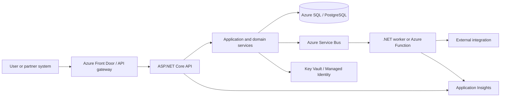
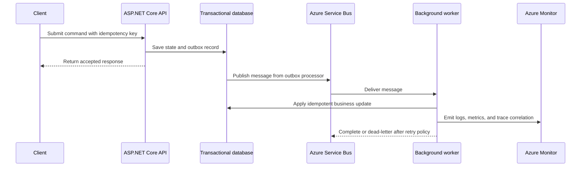

# System Design

System design is the practice of turning business goals, operational constraints, and engineering trade-offs into a system that can be built, operated, and evolved safely. For a Senior .NET/Azure Engineer, good design is not only about drawing components. It is about making reliability, security, observability, cost, and team ownership explicit before production pressure exposes weak assumptions.

This guide provides a practical design approach for cloud-native systems, integration-heavy platforms, and AI-assisted engineering teams that need clear technical direction without unnecessary architecture ceremony.

## Design principles

| Principle | What it means in practice |
| --- | --- |
| Start with outcomes | Define the user, business, compliance, and operational goals before choosing services or patterns. |
| Optimize for change | Keep boundaries and contracts understandable so teams can evolve the system without broad rewrites. |
| Make failure explicit | Design for retries, timeouts, idempotency, fallback behaviour, and observable recovery paths. |
| Own the data model | Clarify sources of truth, consistency expectations, retention rules, and audit requirements early. |
| Prefer managed reliability | Use Azure platform capabilities where they reduce undifferentiated operational burden. |
| Keep humans in the loop | Use AI to accelerate options and reviews, while engineers remain accountable for decisions. |

## Discovery questions

Before proposing a solution, align on the constraints that drive the architecture.

- **Users and workflows:** Who uses the system, what are the critical journeys, and what must never fail silently?
- **Scale profile:** What are expected request rates, data volumes, spikes, batch windows, and growth assumptions?
- **Reliability targets:** What recovery time, recovery point, availability, and degradation expectations are realistic?
- **Security and compliance:** What identity, authorization, privacy, audit, and data residency rules apply?
- **Integration boundaries:** Which upstream and downstream systems are synchronous, asynchronous, or externally owned?
- **Operational ownership:** Which team owns deployment, monitoring, incident response, cost, and lifecycle management?
- **Delivery constraints:** What must ship now, what can be phased, and which choices are expensive to reverse?

## Reference architecture approach

A strong system design should describe the responsibilities and trade-offs across these layers.

### 1. Experience and API layer

- Use clear API contracts with stable resource names, validation rules, versioning strategy, and error models.
- Prefer API Management, gateways, or backend-for-frontend patterns when cross-cutting concerns need consistency.
- Keep authentication, authorization, rate limiting, and request correlation visible at the edge.

### 2. Application and domain layer

- Model business capabilities around cohesive domain boundaries rather than technical folders alone.
- Keep orchestration, validation, policy decisions, and side effects explicit.
- Use a modular monolith when boundaries are still forming; introduce services when independent scaling, ownership, or resilience justifies the operational cost.

### 3. Data and consistency layer

- Define the authoritative source of truth for each business concept.
- Choose consistency deliberately: strong consistency for financial correctness and eventual consistency for read models, notifications, and reporting where appropriate.
- Design idempotency keys, unique constraints, outbox patterns, and replay-safe handlers for message-driven workflows.

### 4. Integration and messaging layer

- Use asynchronous messaging for decoupling, buffering, and resilience when immediate responses are not required.
- Define message contracts, schema evolution, dead-letter handling, retry limits, and poison-message procedures.
- Treat external dependencies as unreliable: isolate failures with timeouts, circuit breakers, bulkheads, and compensating workflows.

### 5. Operations and platform layer

- Build deployment, configuration, logging, metrics, tracing, dashboards, alerts, and runbooks as part of the design.
- Use infrastructure as code and environment parity to reduce release risk.
- Review cost drivers such as always-on compute, data transfer, retention, premium tiers, and over-provisioned capacity.

## Mermaid architecture diagrams

Use diagrams to make service boundaries, runtime flows, and operational ownership visible before implementation starts. These examples show the level of detail I expect in early design reviews: enough to expose coupling and failure modes, without pretending every implementation detail is final.

### Azure-hosted service boundary

This view is useful for discussing trust boundaries, operational ownership, observability, and which components must be deployable or scalable independently.

### Reliable asynchronous workflow

This flow highlights production concerns that should appear in the design: idempotency, outbox publishing, retry limits, dead-letter handling, and correlated telemetry across synchronous and asynchronous work.

## Azure and .NET design considerations

For .NET workloads on Azure, consider these defaults before introducing more complex infrastructure.

- **ASP.NET Core APIs** for request/response workloads with clear contracts and predictable latency requirements.
- **Azure Functions or worker services** for event processing, scheduled jobs, integration adapters, and background automation.
- **Azure Service Bus** when ordered processing, dead-letter queues, duplicate detection, or enterprise messaging semantics matter.
- **Event Grid** when lightweight event routing is enough and subscribers can tolerate eventual delivery.
- **Azure SQL or PostgreSQL** for transactional relational workloads; add read replicas, projections, or caching only when measured needs justify them.
- **Application Insights and OpenTelemetry** for correlation across APIs, queues, dependencies, and background workers.
- **Key Vault and managed identities** for secrets, certificates, and service-to-service authentication.

## AI-assisted design workflow

AI tools can improve system design when used to broaden analysis, not to replace judgement.

Use AI to:

- Generate candidate architectures and compare trade-offs against stated constraints.
- Identify failure modes, race conditions, security gaps, and observability blind spots.
- Draft ADRs, sequence diagrams, rollout plans, and production readiness checklists.
- Create review prompts for APIs, event contracts, data migrations, and runbooks.

Validate every AI-generated recommendation against production evidence, platform documentation, team capability, and the system's real constraints.

## Design review checklist

- [ ] The problem statement and success metrics are clear.
- [ ] Core workflows, integrations, and data ownership are documented.
- [ ] Reliability, security, compliance, performance, and cost trade-offs are explicit.
- [ ] Failure modes include retries, timeouts, idempotency, rollback, and manual recovery.
- [ ] Observability covers logs, metrics, traces, dashboards, alerts, and ownership.
- [ ] The rollout plan includes migration steps, compatibility, testing, and fallback options.
- [ ] Durable decisions are captured in an ADR with context and consequences.

## Related sections

- [System Design Patterns](system-design-patterns.md) for reusable architecture patterns and implementation examples.
- [Architecture Decision Framework](architecture-decision-framework.md) for comparing options and recording trade-offs.
- [Production Readiness Checklist](production-readiness-checklist.md) for validating release and operational readiness.
- [AI-Assisted Engineering](ai-assisted-engineering.md) for using AI responsibly in technical design and delivery.
- [Architecture Decision Records](architecture-decision-records.md) for documenting durable architecture choices.
- [Incident Response](incident-response.md) for operating the system when production assumptions fail.
